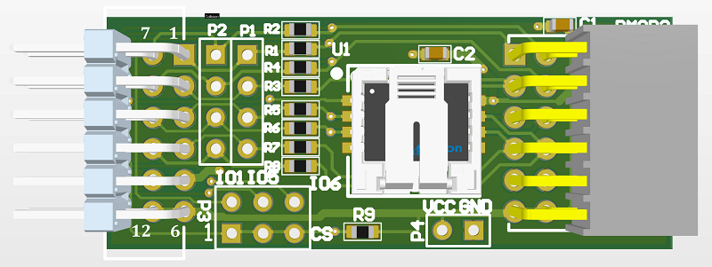
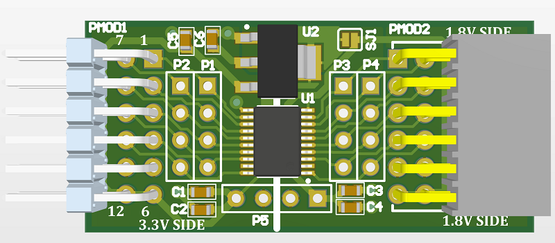

# PMOD Utility for FPGA Boards

## QSPI to WSON-6x8

Converts PMOD to a WSON 6x8. Allows selection of CS pin between three IO pins which aren't used
for the QSPI interface.

## 3.3V to 1.8V Translator

Uses bidirectional translator to convert 3.3V FPGA I/O to 1.8V signals. Includes voltage regulator
to generate 1.8V (can be disabled with solder jumper).

Based on TXB0108PWR, which is rated ~60mbps at 3.3V to 1.8V translation. The chip has auto direction switching, so "should" just work with QSPI. Might require changes to pull-up resistors however.

